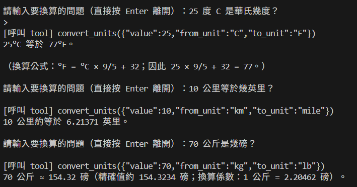

# Unit Converter — 自然語言單位換算

以自然語言輸入換算問題的 CLI 工具。使用者輸入描述性的句子（例如「25 度 C 是華氏幾度？」），系統透過 OpenAI Function Calling 自動呼叫換算工具並回傳結果。

## 架構

```
使用者以自然語言輸入換算問題
        ↓
  OpenAI GPT（Tool Calling）      (gpt-5-mini)
        ↓
  convert_units 工具               (溫度 / 距離 / 重量)
        ↓
  CLI 互動介面 (main.js)          →  輸入問題 → 呼叫工具 → 格式化回傳結果
```

## 技術棧

| 元件 | 說明 |
|------|------|
| OpenAI `gpt-5-mini` | 解析使用者意圖並決定是否呼叫換算工具 |
| Function Calling | 將換算邏輯以工具形式定義，讓 GPT 自動呼叫 |
| Node.js + `readline` | 互動式 CLI 介面，逐行讀取使用者輸入 |
| `ora` | 顯示思考中 spinner，提升使用體驗 |

## 支援換算類型

| 類型 | 換算方向 |
|------|---------|
| 溫度 | 攝氏 (°C) ↔ 華氏 (°F) |
| 距離 | 公里 (km) ↔ 英里 (mile) |
| 重量 | 公斤 (kg) ↔ 磅 (lb) |

## 快速開始

```bash
# 1. 安裝相依套件
npm install

# 2. 設定環境變數
cp .env.example .env
# 填入 OPENAI_API_KEY

# 3. 啟動換算介面
npm start
```

直接按 `Enter` 離開程式。

## 換算結果範例

### 溫度、距離、重量換算示意


